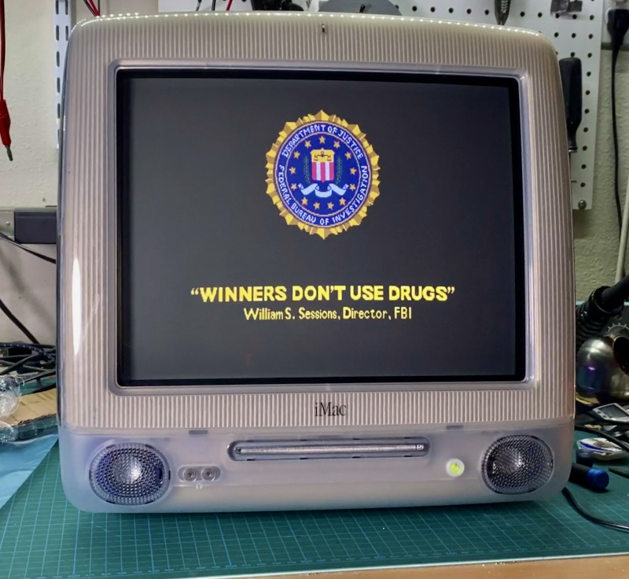
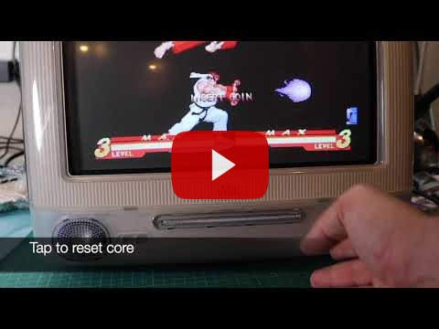
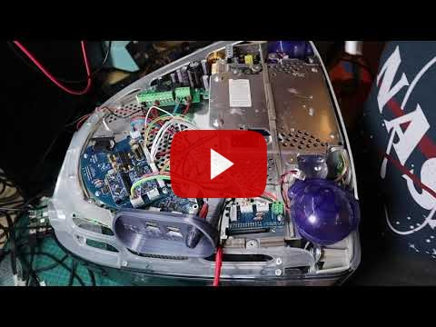
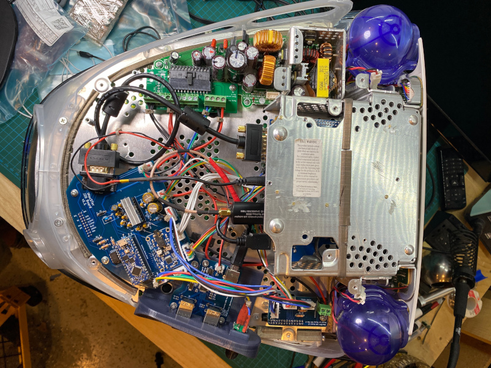
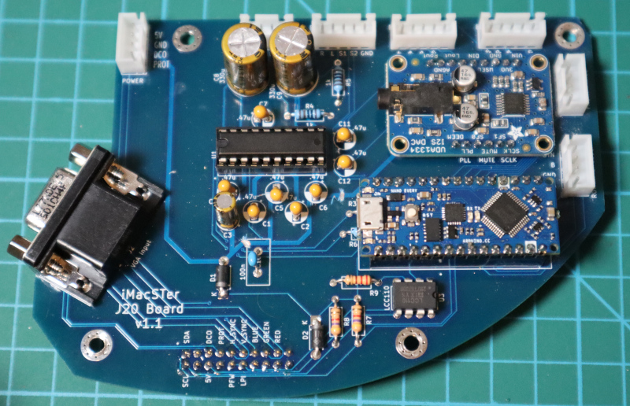
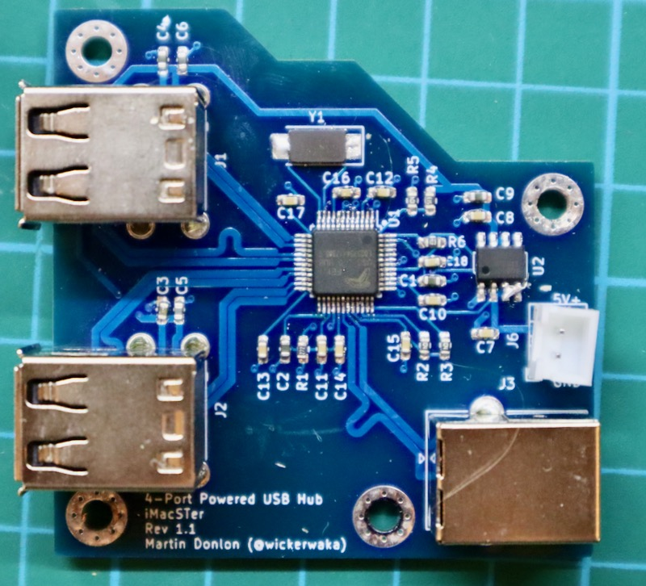
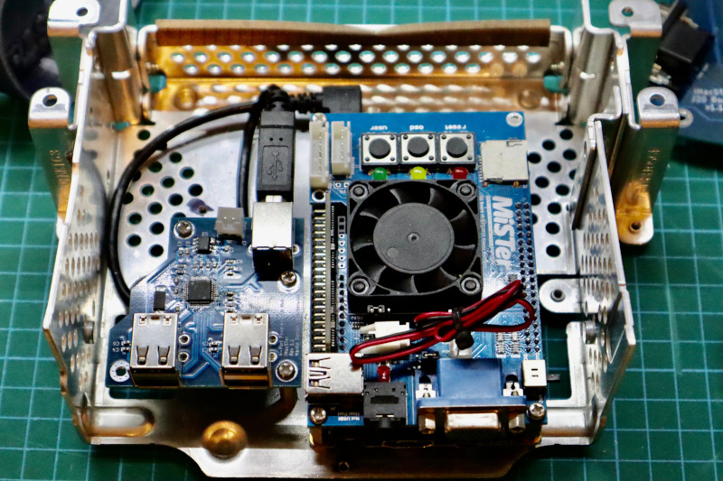
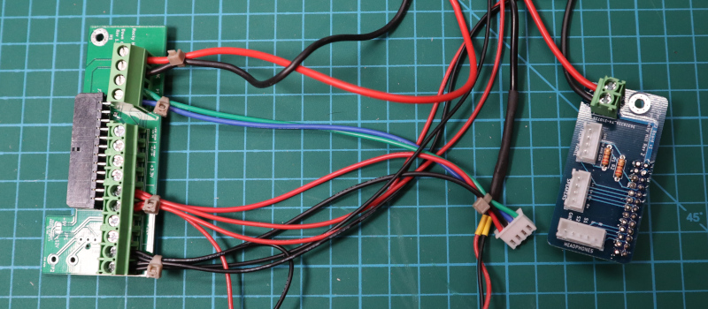
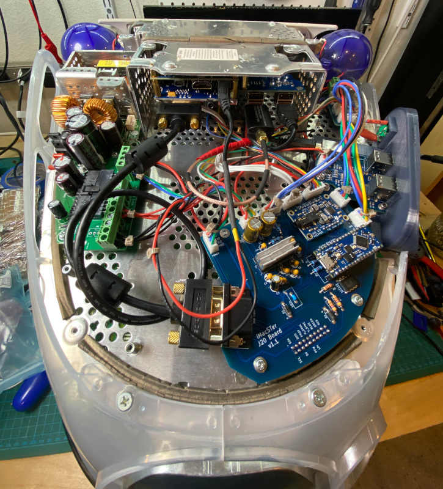
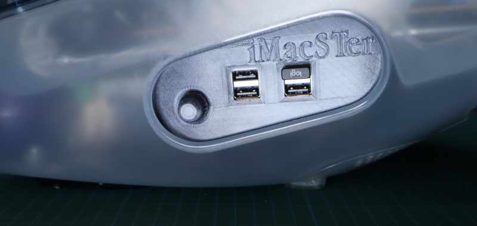

# iMacSTer

The iMacSTer is an early 2000's Apple iMac G3 with a MiSTer FPGA multisystem emulator inside of it. It is intended to be a non-destructive modification so the iMac can be returned to it's original state if desired. The mainboard, drives and IO panel are removed and replace by custom hardware, but no cuts are made to the chassis and the new hardware connects to existing internal connections without the need for any soldering. That being said, I can make no guarantees about the long term implications of these modifications. The speakers are being driven by a different amplifier than they were intended for, the new hardware only uses the 5V output from a power supply which is expecting load on the 3.3V and 12V lines also, the monitor is being driven at a resolution higher than it was intended for, heat generation and dissipation characteristics have changed, etc, etc.

## Past Work
None of this would be possible without the work of Rocky Hill and others to reverse engineer the iMac internals and design custom hardware and software to interface with it. I would not have attempted this project if the [imac_g3_ivad_board_init](https://github.com/qbancoffee/imac_g3_ivad_board_init) project did not exist. My PCBs and software is all based on that work and I still use the down converter adaptor board from that project because there was no need to change it.

I also used the IO shield designs that @Diepzeevogel created as part of their [replacement parts project](https://github.com/Diepzeevogel/iMac-G3-replacement-parts) as the basis for my own IO shield. The fit and quality that they were able to achieve is beyond my own skills.

## Features
 * 2W x 2 Stereo amplifier
 * Dual headphone ports for two player fun
 * External volume control
 * 4 external USB ports
 * Built-in WiFi
 * Access to all MiSTer buttons and OSD
 * Sleek design for any modern home

[Other Random Photos](https://photos.app.goo.gl/XmcNqWLyWzHymW5z9)

## Assembly

## Main Board

The main board controls the whole system. It contains an I2S digital-to-analog audio converter, an audio amplifier and an Arduino Nano Every for controlling everything. It connects to the J20 connector inside the iMac which provides 5V to the microcontroller even when the system is powered down. The J20 port is also where the VGA signals are from the VGA connector on the board.

The amplifier is a Texas Instruments [TPA6021A4](https://www.ti.com/lit/ds/symlink/tpa6021a4.pdf) 2W Stereo amplifier. I picked this one because it was in the power range I needed, it supported a headphone mode, the volume level could be controlled by a microcontroller and it came in a through-hole package. That last point really limits the options since most amplifier ICs with similar features come in surface mount packages. When I started this project I had no experience designing PCBs or using surface mount components, so I was limiting myself to through-hole parts. The decoupling, biasing and filtering capacitors in the amplifier section are all directly copied from the reference schematics in the datasheet, with the exception of the output capacitors which I switch from 330uF to 2200uF in order to get more bass.

The amplifier output is connected to the speakers and headphones via two JST connectors. The iMac has two separate headphone ports on the front and each has their own headphone sense signal. These signals need to be OR'd together to determine whether the amplifier should be in single ended (headphone) mode or not. This is done by the arduino rather than a separate IC, which has the added advantage of allowing separate volume settings for speaker and headphone mode.

The audio input to the amplifier comes from the [UDA1334A](https://cdn-shop.adafruit.com/product-files/3678/UDA1334ATS.pdf) [breakout board](https://www.adafruit.com/product/3678) from Adafruit. The UDA1334A decodes the I2S audio data from the MiSTer and converts it to an analog signal. I had assumed the output capacitors on the breakout board would block DC into the amplifier so an earlier version of the board did not have any capacitors protecting the input. That assumption cost me a pair of speakers, they literally ripped themselves apart.

The arduino controls the system power, the CRT configuration, the amplifier, the buttons and LEDs on the case and the three standard buttons on the MiSTer. I considered using an ATmega microcontroller directly instead of the Nano Every, however the Nano packs a lot of features into a small space. I want the convenience of a USB port without having to worry about whether I've hooked it all up correctly. 

iMac video hardware requires a special initialization sequence to be sent via I2C before it will power on the CRT and start displaying an image ([much more detailed explaination here](https://github.com/qbancoffee/imac_g3_ivad_board_init/wiki/Convert-and-iMac-G3-slot-loader-into-a-standard-VGA-monitor)). The I2C connection is also used to configure display properties like brightness and alignment. These settings are stored in EEPROM and can be modified using serial commands.

## USB Hubs

There are two USB hubs inside, one is used for internal connections and one is mounted on the IO shield for external connections. The hub is based on the [FE1.1](https://elinux.org/images/e/ee/FE11-datasheet.pdf) chip which does pretty much everything. Building my own USB hubs is not something I considered doing at the start of this project, I had never designed a PCB and I had never used surface mount components. I had deliberately avoided surface mount components when picking an amplifier for the main board. This seemed achievable though and I had watched enough videos at this point to not be terrified of surface mount soldering. It was pretty surprising when it worked!

The hub includes a current-limited switch, but I have not been able to get the power control from the FE1.1 to work correctly. For now it is latched one with a blob of solder. There is still some current limiting due to the thermal shutoff building into the switch, but it is not going to be reported to the hub correctly.

## MiSTer

The [MiSTer](https://github.com/MiSTer-devel/Main_MiSTer/wiki) setup is the standard combo of DE-10 Nano, 128MB SDRAM and the analog IO board. The 5-pin button and I2S headers are connected to the matching headers on the main board. The MiSTer is mounted in the drive bay alongside one of the USB hubs. I drilled and tapped holes in the drive bay to allow both of them to be mounted. This is a destructive modification, though it is not externally visible and does not impact the functionality of the drive bay if the original drives ever needed to be added back in.

## Power and Front Panel

The power for the system comes from the J22 connector as 24VAC. This 24VAC is feed into the down converter board which outputs 12V, 5V and 3.3V DC. The 5V output is used to power everything else in the system. The J22 connector also has connections for the speakers, headphones, power button and it's LEDs. This are all exposed through three JST connectors on the adaptor board.

## IO Shield

The IO shield provides a mounting point for the external USB hub and the rotary encoder. Thanks to the work [here](https://github.com/Diepzeevogel/iMac-G3-replacement-parts) it matches the curves of the case very closely. It is 3D printed using eSUN's Semi-transparent Gray PETG filament which matches well with the "Graphite" color of this iMac.

The metal plate that the IO shield is attached to has a lot of holes so finding suitable attachment points was not difficult. However getting access to the other side of that metal plate is extremely difficult so I opted to build in some plugs that expand when a bolt is screwed into them, similar to dry wall screws. 

## Video Modes
The CRT in the iMac is limited to a horizontal sync of 57-63KHz. The only mode suitable for 60Hz refresh rate is 1280x960. At this resolution the horizontal refresh rate is 1000x the vertical rate so when using `vsync_adjust` the vertical rate can be adjusted from 57-63Hz, which gives good coverage for NTSC and most arcade systems. The brightness and alignment of the screen does change across that frequency range, so at the extremes the picture will be slightly distorted. A future version of the board may sample the hsync signal and adjust the video settings based on it.

